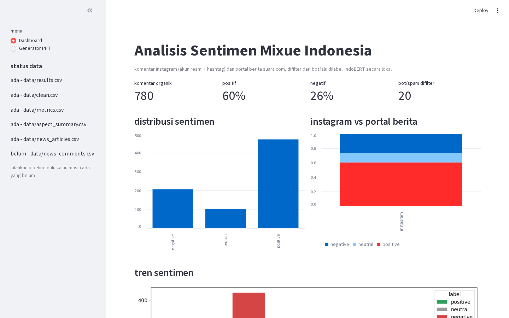
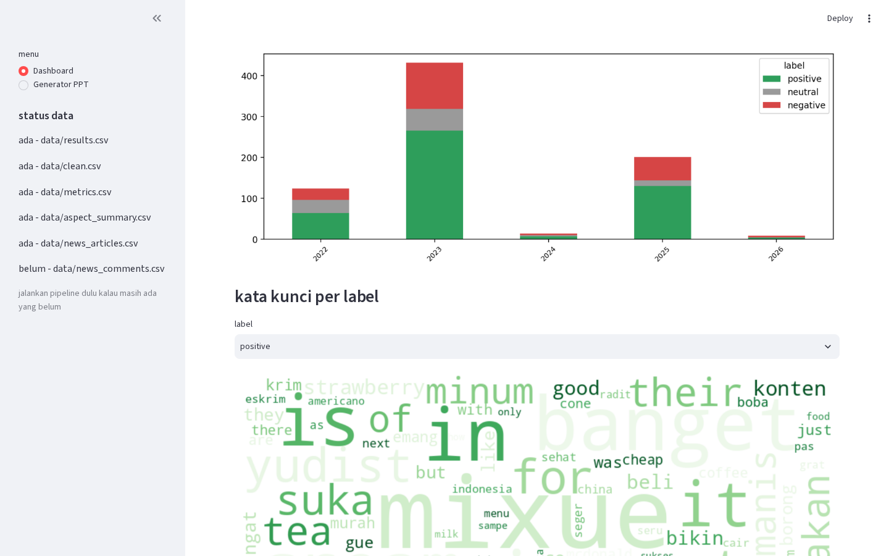
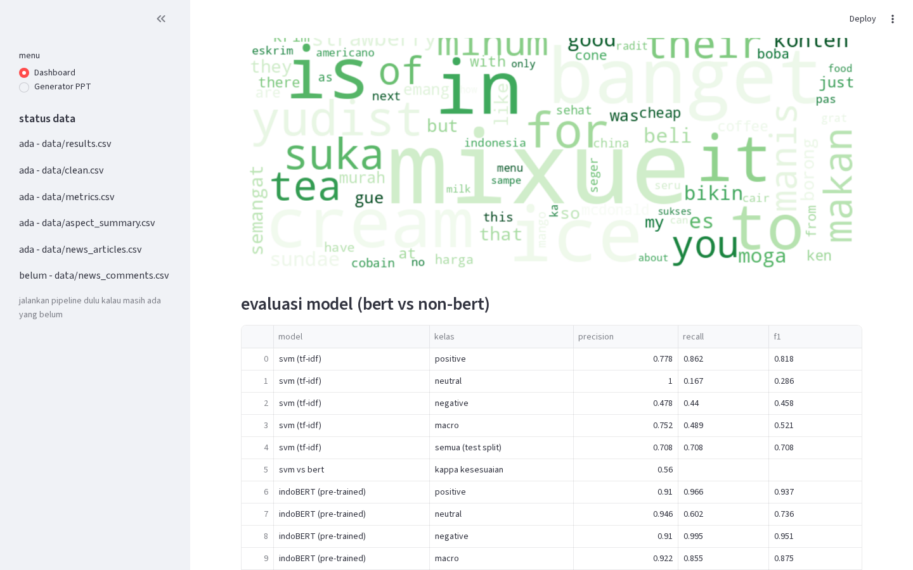
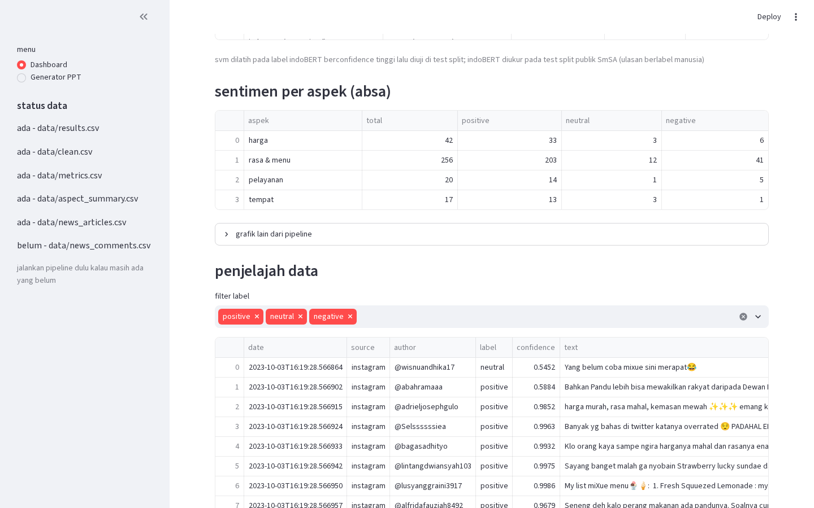
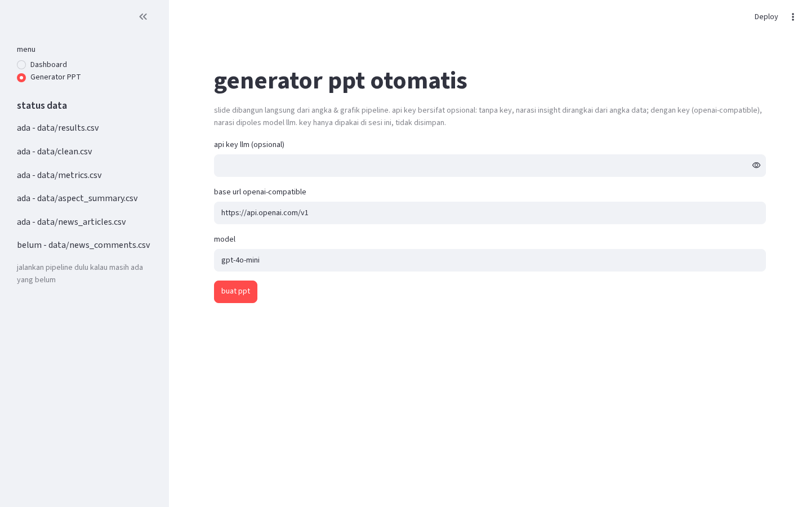

# mixue indonesia sentiment

Social media analytics project: what do people actually say about Mixue Indonesia? Opinions are crawled from Instagram (#mixueindonesia) and from one leading news portal (suara.com), cleaned, filtered from bots, then modeled with sentiment analysis, aspect-based sentiment (ABSA) and topic modeling, following the bootcamp project brief.

## how to run

```
pip install -r requirements.txt
python scrape.py      # instagram, needs your own login (non-API scraping per the brief)
python news.py        # suara.com, no login needed
python clean.py       # preprocessing + bot detection
python sentiment.py   # indoBERT labeling + bert vs classical comparison
python absa.py        # sentiment per aspect (harga, rasa, pelayanan, tempat)
python topics.py      # lda topic modeling
python analytics.py   # account + media analysis
streamlit run dashboard.py   # dashboard + auto ppt generator (the brief's report automation)
```

each script can be rerun; scrapers append what they have not saved yet and dedupe on load.

## dashboard

`streamlit run dashboard.py` opens a plain app over the pipeline output (no model rerun, opens in seconds) with a ppt generator on the second page:







## scripts vs the brief

| brief item | script |
|---|---|
| source 1: instagram comments (username, text, timestamp) | scrape.py |
| source 2: one leading news portal, articles + reader comments if available | news.py |
| stage 01: case folding, noise removal, stopword removal + stemming (sastrawi) | clean.py |
| stage 02: bot vs non-bot detection (rule-based) | clean.py |
| sentiment analysis + visualization | sentiment.py |
| bert vs non-bert comparison (accuracy, precision, recall, f1) | sentiment.py |
| aspect-based sentiment analysis | absa.py |
| topic modeling (lda) | topics.py |
| account analysis (kol, engagement) + media analysis | analytics.py |
| report automation: streamlit ui + ai-generated ppt | dashboard.py |

## data files

- data/mixueindonesia_*.csv - instagram posts under the hashtag
- data/mixueindonesia_comments_*.csv - comments per post
- data/news_articles.csv, data/news_comments.csv - suara.com articles and reader comments
- data/clean.csv - merged comments, preprocessed, bot-flagged
- data/results.csv - every organic comment with label and model confidence
- data/metrics.csv - the evaluation table (svm + bert, per class and macro) shown on the dashboard
- data/aspect_summary.csv - sentiment per aspect
- data/smsa_test.tsv - public smssa benchmark split, downloaded once to score indoBERT itself

## honest notes

- instagram scraping uses instaloader with your own account session (the brief forbids bearer-token APIs and X/Twitter; instaloader is non-API scraping). the login and 2FA flow is the original one from the crawler, sessions are saved locally so you only log in once.
- suara.com keeps an open reader-comment system and news.py reads it straight from the portal's own endpoint, no login. one honest finding up front: as of now the mixue-tagged articles there carry basically no reader comments (indonesian news portals have quietly died as discussion venues, the action moved to social media). the extraction is implemented and works on any article that has comments; rerun news.py anytime and new comments get picked up automatically.
- bert vs classical: there are no hand-annotated labels for the scraped comments, so the classical tf-idf + svm model is trained on the high-confidence part of the indoBERT labels and evaluated on a held-out split (plus a kappa agreement score over the whole corpus) - it measures how well the classical model approximates the transformer. for the bert side itself, sentiment.py scores the pretrained model on the public smssa test split (500 indonesian reviews labeled by human annotators, kept out of the model's own fine-tuning), which gives real accuracy/precision/recall/f1 numbers for the evaluation table. fine-tuning indoBERT was deliberately skipped: the brief allows pre-trained or fine-tuned, and fine-tuning on the model's own pseudo-labels would just teach it to agree with itself.
- preprocessing keeps two views: text_clean (folded, noise-stripped, slang-normalized) for the classical model, tokens (stopwords removed + sastrawi stemming) for lda/wordclouds. the transformer itself gets lightly cleaned raw text because it handles slang and context on its own.
- data/*.csv contains usernames, keep it local.
- instagram yield: scrape.py pulls the official account(s) first (their posts carry the big comment sections), then the hashtags, and grabs comment replies too. if the yield still feels small, add more accounts/hashtags to the ACCOUNTS/HASHTAGS lists at the top of scrape.py, raise the post caps, or just run it again on another day - each run appends new comment ids and clean.py dedupes on load. instagram rate limits mean a full run can take a while; the progress line per post shows exactly where the comments are coming from.
- dashboard.py is a plain streamlit app over data/*.csv - no model rerun, it opens in seconds. the ppt generator builds the deck from the pipeline's own numbers and figures; the llm api key is optional and only rewrites the insight narrative (openai-compatible endpoint, key typed at runtime, never stored). without a key the narrative is still generated, just from the measured numbers directly. google slides import: upload the .pptx to drive and open with slides, or File > Import slides - no oauth plumbing on purpose.
